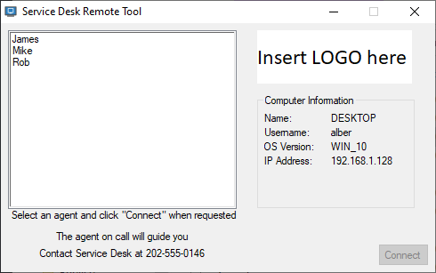

# SD Remote Tool

A simple installable tool inspired by [UltraVNC's SingleClick](https://uvnc.com/products/uvnc-sc.html) tool for computers running the [UltraVNC](https://uvnc.com/) server and need to initiate a reverse connection to a list of support agents who are running the [UltraVNC](https://uvnc.com/) Viewer running on Listen mode.

This allows users or customers running the [UltraVNC](https://uvnc.com/) server to connect to support agents using a reverse connection system. Useful when certain IT remote tools are not working, the user is behind a firewall blocking incoming connections, or when users are unable to provide certain basic information. This information can be found in the tool when started up as shown on the image above.

## Usage cases
This tool would be suitable for a Service Desk or a Support Team. The users or customers' computers would be running [UltraVNC](https://uvnc.com/) Server on their machines, and the support agents would be running the [UltraVNC](https://uvnc.com/) Viewer on Listen mode. The users or customers would also have the SD Remote Tool installed on their machines (check the Installation and Deploying section below).

Once a user calls the Service Desk or Support Team for help, if the support agent cannot initialize a connection to the user's computer, then the user could open the SD Remote tool, and select the agent from the list. By doing this, a reverse connection would be initiated from the [UltraVNC](https://uvnc.com/) server running on the user's computer, to the [UltraVNC](https://uvnc.com/) Viewer on the support agent's computer running on Listen Mode. After this is done, a prompt will show up on the support agent's computer asking whether to accept or reject the connection.

Also, if needed, the tool also displays some information such as the hostname, username, operative system and IP addresses which may be valuable for the support agent.

This tool can be extremely useful when firewall restrictions apply, such as blocking incoming traffic. Since most firewalls are setup to block incoming traffic, but not outgoing traffic, a reverse connection will help indeed.

## Customization
SD Remote Tool can be customized for the most part without recompiling the executable.

`agents.txt` 
Support agents should be included here in a `agent,hostname` format.
These will be shown on the tool when it is started. When an agent is selected and the "Connect" button is pressed, a connection will be initiated to the host of the support agent, prompting a question to the agent to accept, or reject the connection from the user or customer. Once the connection is accepted, the support agent will be able to control the user's computer.

`icon.ico` 
The icon can be replaced by another icon that suits the organization or company. (Needs recompiling)

`logo.bmp` 
This logo goes on the top right side of the tool's window (Insert LOGO here). Can be replaced with a logo that suits the organization or company.

`strings.txt` 
These are the text strings shown below the agents list. Use this to provide steps for the users to follow. Top, middle, and bottom strings.

## Encrypted connections
[UltraVNC](https://uvnc.com/) supports encrypted connections, a must if these connections are going to be done over an unsecure environment. Please check this [encryption guide](https://uvnc.com/docs/documentation-1-3-0/133-howto-add-encryption.html).

## Source code
This tool is quite old, not maintained anymore and it is provided as-is. It was written for a customer I worked with. Written in [AutoIt v3](https://www.autoitscript.com/site/) and its source contains [compiler directives](https://www.autoitscript.com/autoit3/scite/docs/SciTE4AutoIt3/directives-available.html) of the [AutoIt3Wrapper](https://www.autoitscript.com/autoit3/scite/docs/SciTE4AutoIt3/AutoIt3Wrapper.html) as follows:

    #Region ;**** Directives created by AutoIt3Wrapper_GUI ****
    #AutoIt3Wrapper_Icon=icon.ico
    #AutoIt3Wrapper_Outfile=helpdesk.exe
    #EndRegion ;**** Directives created by AutoIt3Wrapper_GUI ****

You might need to install the full [SciTE v3 editor](https://www.autoitscript.com/site/autoit-script-editor/downloads/) to be able to read these directives when compiling by default.

## False positives
[AutoIt](https://www.autoitscript.com/site/) is a great and powerful scripting language that has been running around for years. Unfortunately, malware has been written using this scripting language and some Antivirus software might trigger alerts. An official wiki article can be found [here](https://www.autoitscript.com/wiki/AutoIt_and_Malware)

## Using another remote administration tool
This tool acts as a frontend for [UltraVNC's viewer listen mode](https://uvnc.com/docs/uvnc-viewer/52-ultravnc-viewer-commandline-parameters.html) using the reverse connection capability where the viewer will accept incoming connections from a [UltraVNC](https://uvnc.com/) server. However, it can be altered to support any other remote administration tool that supports reverse connections as well, such as other VNC protocol based tools such as [TightVNC](https://www.tightvnc.com/), [TigerVNC](https://tigervnc.org/), and others. You will need to edit the source code to your needs, though.

## Installation and Deploying
An installer script written in [InnoSetup](https://jrsoftware.org/isinfo.php) is included inside the `installer` folder. Use this to build your installer so you can deploy it on your users or customer's computers. Also, a compiled installer is also provided for testing.

By default, this install script does not ask for a folder to install the software, and it adds the Start Menu and Desktop icon shortcuts.

### Silent Install
For silent deployments, use the `/SILENT` or `/VERYSILENT` command line parameters when calling the installer. For more info, check the [InnoSetup command line parameters](https://jrsoftware.org/ishelp/index.php?topic=setupcmdline) documentation.

## FAQ

**Q. SD Remote Tool reports [UltraVNC](https://uvnc.com/) is not installed** 
**A.** Check that [UltraVNC](https://uvnc.com/) is installed, the following registry keys are checked:
* If OS is 64 bit: `HKLM64\SOFTWARE\Microsoft\Windows\CurrentVersion\Uninstall\Ultravnc2_is1\InstallLocation`
* If OS is 32 bit: `HKLM\SOFTWARE\Microsoft\Windows\CurrentVersion\Uninstall\Ultravnc2_is1\InstallLocation`

**Q. Why is the .exe file so large?** 
**A.** [AutoIt](https://www.autoitscript.com/site/) v3 executables include all libraries and necessary runtimes inside the .exe file so the executable size becomes larger. As a benefit, it can run on any Windows machine out of the box.

**Q. The executable file triggers an alert on my Antivirus software** 
**A.** [AutoIt](https://www.autoitscript.com/site/) is a great and powerful scripting language that has been running around for years. Unfortunately, malware has been written using this scripting language and some Antivirus software might trigger alerts. Please read [AutoIt and Malware](https://www.autoitscript.com/wiki/AutoIt_and_Malware) for more information.

**Q. Will this work with other remote software?** 
**A.** This software is provided as is; it has been developed a long time ago to cover specific needs for a project I worked with in the past. However, by editing the source code you should be able to modify it and make it work with the remote administration tools you might be using.

**Q. When compiling the executable using the source, the icon doesn't show up and the file name doesn't match** 
**A.** Most likely the compiler is not reading the [compiler directives](https://www.autoitscript.com/autoit3/scite/docs/SciTE4AutoIt3/directives-available.html) of the [AutoIt3Wrapper](https://www.autoitscript.com/autoit3/scite/docs/SciTE4AutoIt3/AutoIt3Wrapper.html) properly.
Besides installing [AutoIt](https://www.autoitscript.com/site/) v3, you will also need to install [SciTE v3 editor](https://www.autoitscript.com/site/autoit-script-editor/downloads/).
I don't know if there is another method to do this without installing the editor, but this is what I have done myself. Please check the Source code section above on this Readme.

**Q. Does [UltraVNC](https://uvnc.com/) support encrypted connections?** 
**A.** Yes, so do [TightVNC](https://www.tightvnc.com/) and [TigerVNC](https://tigervnc.org/). This is highly recommended on unsecure environments. Please check this [encryption guide](https://uvnc.com/docs/documentation-1-3-0/133-howto-add-encryption.html).

**Q. Is this customizable?** 
**A.** Yes, everything except the icon. You can customize the logo, the agents list, and the text strings displayed. See the Customization section above.

**Q. What is a reverse connection, and what benefits does it provide?** 
**A.** A reverse connection is usually used to bypass firewall restrictions on open ports. A firewall usually blocks incoming traffic, but does not block outgoing traffic. This will allow to perform a connection to a machine that might be behind a firewall blocking incoming connections.

**Q. What is the [UltraVNC](https://uvnc.com/) listen mode?** 
**A.** It is a mode where the [UltraVNC](https://uvnc.com/) viewer (client) is set to listen for incoming connections from a [UltraVNC](https://uvnc.com/) server performing a reverse connection. [TightVNC](https://www.tightvnc.com/) and [TigerVNC](https://tigervnc.org/) support it as well.

## Links
* [UltraVNC](https://uvnc.com/)
* [UltraVNC SingleClick](https://uvnc.com/products/uvnc-sc.html)
* [UltraVNC command line reference](https://uvnc.com/docs/uvnc-viewer/52-ultravnc-viewer-commandline-parameters.html)
* [UltraVNC encryption guide](https://uvnc.com/docs/documentation-1-3-0/133-howto-add-encryption.html)
* [AutoIt](https://www.autoitscript.com/site/)
* [AutoIt compiler directives](https://www.autoitscript.com/autoit3/scite/docs/SciTE4AutoIt3/directives-available.html)
* [AutoIt3Wrapper](https://www.autoitscript.com/autoit3/scite/docs/SciTE4AutoIt3/AutoIt3Wrapper.html)
* [AutoIt and Malware](https://www.autoitscript.com/wiki/AutoIt_and_Malware)
* [SciTE v3 editor](https://www.autoitscript.com/site/autoit-script-editor/downloads/)
* [InnoSetup](https://jrsoftware.org/isinfo.php)
* [InnoSetup command line parameters](https://jrsoftware.org/ishelp/index.php?topic=setupcmdline)
* [TightVNC](https://www.tightvnc.com/)
* [TigerVNC](https://tigervnc.org/)
